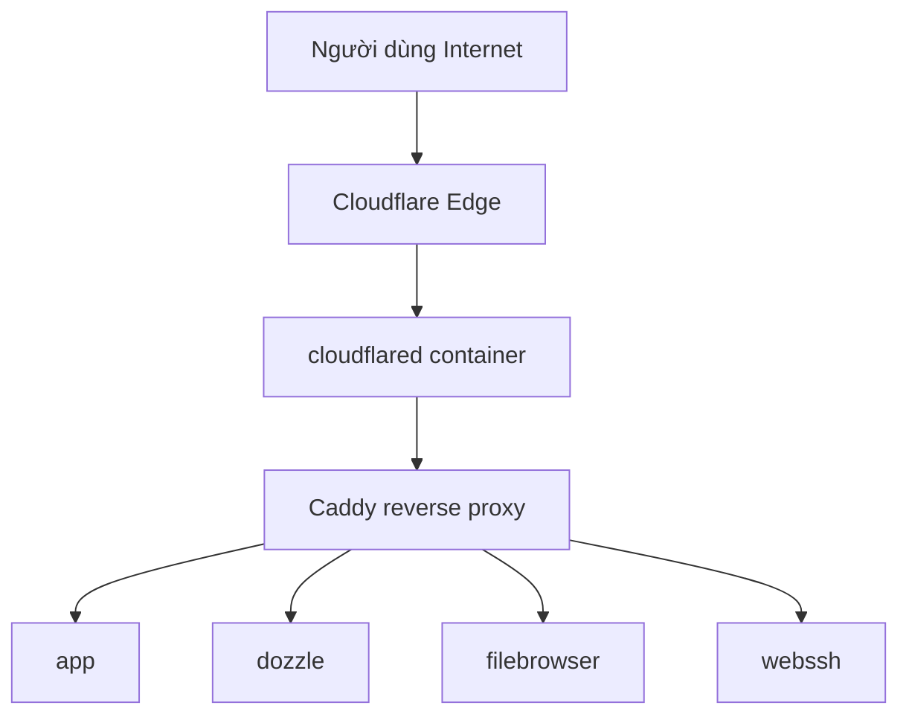
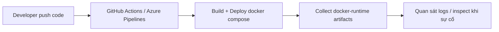
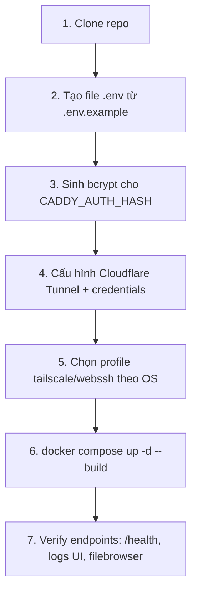

# my-docker-app

Stack Docker mẫu để vận hành một ứng dụng Node.js theo hướng production-ready, có:

- Reverse proxy tự động (Caddy + Docker labels)
- Expose ra Internet qua Cloudflare Tunnel (không cần mở port public)
- Truy cập nội bộ qua Tailscale (tuỳ chọn)
- Quan sát hệ thống với Dozzle, Filebrowser, WebSSH
- Pipeline triển khai qua GitHub Actions / Azure Pipelines

---

## 1) Tổng quan kiến trúc

### Thành phần chính

| Thành phần | Vai trò |
|---|---|
| `caddy` | Reverse proxy, terminate TLS, đọc route từ Docker labels |
| `cloudflared` | Tạo tunnel từ Cloudflare Edge vào `caddy` trong mạng nội bộ Docker |
| `tailscale-linux` / `tailscale-windows` | Kết nối private network cho team nội bộ |
| `app` | API Node.js (Express) với endpoint `/`, `/health`, `/logs/tail` |
| `dozzle` | Xem log realtime của container |
| `filebrowser` | Duyệt file, tải log |
| `webssh` / `webssh-windows` | Truy cập shell host qua web (phục vụ vận hành/debug) |

### Luồng request từ Internet



### Luồng triển khai CI/CD



---

## 2) Cấu trúc codebase

```text
my-docker-app/
├── docker-compose.yml
├── .env.example
├── cloudflared/
│   ├── config.yml
│   └── config.yml.example
├── services/
│   ├── app/
│   │   ├── Dockerfile
│   │   ├── index.js
│   │   └── package.json
│   ├── webssh/
│   └── webssh-docker/
└── docs/
    ├── docker-app.md
    ├── docker-caddy.md
    ├── docker-cloudflared.md
    ├── docker-dozzle.md
    ├── docker-filebrowser.md
    ├── docker-portainer.md
    └── docker-tailscale.md
```

---

## 3) Quick start (flow rõ từng bước)



### Bước 1: Clone

```bash
git clone <repo-url>
cd my-docker-app
```

### Bước 2: Tạo `.env`

```bash
cp .env.example .env
```

Sau đó chỉnh các biến quan trọng:

- `DOMAIN`, `APP_HOST`, `CADDY_EMAIL`
- `CADDY_AUTH_USER`, `CADDY_AUTH_HASH`
- `TAILSCALE_CLIENT_SECRET` (nếu dùng Tailscale)
- `SUBDOMAIN_*` cho từng service

> Lưu ý: `docker-compose.yml` hiện dùng `TAILSCALE_CLIENT_SECRET`, vì vậy bạn nên đặt đúng tên biến này trong `.env`.

### Bước 3: Sinh hash mật khẩu Caddy

```bash
docker run --rm caddy:alpine caddy hash-password --plaintext "<mat_khau_moi>"
```

Copy kết quả vào `CADDY_AUTH_HASH` (nếu dùng trong `.env`, nhớ escape ký tự `$` theo format đang ghi chú).

### Bước 4: Cloudflare Tunnel

`cloudflared` trong repo đang chạy bằng file config + credentials:

- `./cloudflared/config.yml`
- `./cloudflared-credentials.json`

Bạn cần:

1. Tạo tunnel trong Cloudflare Zero Trust
2. Cập nhật hostname mapping trỏ về `http://caddy:80`
3. Điền `tunnel` + `credentials-file` phù hợp trong `cloudflared/config.yml`

### Bước 5: Chọn profile theo môi trường

- Linux host:
  - Dùng profile `linux-only` cho `tailscale-linux` + `webssh`
- Windows host:
  - Dùng profile `windows-only` cho `tailscale-windows` + `webssh-windows`

Ví dụ:

```bash
# Linux
docker compose --profile linux-only up -d --build

# Windows
docker compose --profile windows-only up -d --build
```

### Bước 6: Kiểm tra nhanh sau khi chạy

```bash
docker compose ps
docker compose logs -f --tail=100 app
curl -sS http://localhost:${APP_PORT:-3000}/health
```

---

## 4) Endpoint & truy cập

### API app

- `GET /` → thông tin service
- `GET /health` → trạng thái app + uptime
- `GET /logs/tail` → 50 dòng log cuối

### Dịch vụ qua Caddy (theo `SUBDOMAIN_*`)

- `app.<DOMAIN>` → Node.js app
- `logs.<DOMAIN>` (hoặc subdomain cấu hình) → Dozzle
- `files.<DOMAIN>` (hoặc subdomain cấu hình) → Filebrowser
- `ttyd.<DOMAIN>` (hoặc subdomain cấu hình) → WebSSH

---

## 5) Lệnh vận hành thường dùng

```bash
# Chạy stack
docker compose up -d

# Build lại + chạy
docker compose up -d --build

# Xem trạng thái
docker compose ps

# Theo dõi log toàn bộ
docker compose logs -f

# Theo dõi log app
docker compose logs -f app

# Restart riêng app
docker compose restart app

# Dừng stack
docker compose down

# Dừng + xoá volume
docker compose down -v
```

---

## 6) Mở rộng dự án (gợi ý thực tế)

### 6.1 Thêm service mới sau Caddy

Chỉ cần thêm service + labels trong `docker-compose.yml`:

```yaml
my-new-service:
  image: your-image:latest
  labels:
    - "caddy=http://new.${DOMAIN}"
    - "caddy.reverse_proxy={{upstreams 8080}}"
    - "caddy.basic_auth=/*"
    - "caddy.basic_auth.${CADDY_AUTH_USER}=${CADDY_AUTH_HASH}"
  networks: [app_net]
```

### 6.2 Tách môi trường `dev/staging/prod`

- Dùng nhiều file compose:
  - `docker-compose.yml` (base)
  - `docker-compose.prod.yml` (override prod)
- Tách `.env` theo môi trường
- Map subdomain riêng: `staging-api`, `api`, ...

### 6.3 Nâng cấp quan sát

- Thêm metrics/log stack (Prometheus + Grafana, Loki)
- Healthcheck chuẩn cho từng container
- Cảnh báo khi container restart bất thường

### 6.4 Bảo mật nâng cao

- Chuyển từ Basic Auth sang SSO/Access Policy (Cloudflare Access)
- Giới hạn IP / mTLS cho endpoint admin
- Tách quyền đọc log và quyền shell (webssh) theo vai trò

### 6.5 Chuẩn hoá vận hành team

- Thêm Makefile / task runner cho lệnh common
- Viết runbook sự cố (mất tunnel, cert lỗi, app crash)
- Chuẩn hoá backup cho volumes quan trọng

---

## 7) Lưu ý bảo mật

- Không commit `.env`, `cloudflared-credentials.json`, private key SSH
- `webssh` cho quyền truy cập rất mạnh, chỉ bật khi thật sự cần
- Dùng mật khẩu mạnh và rotate định kỳ cho tài khoản bảo vệ qua Caddy
- Bật audit log cho nền tảng CI/CD nếu triển khai production

---

## 8) Tài liệu chi tiết

Xem thêm trong thư mục `docs/`:

- `docs/docker-app.md`
- `docs/docker-caddy.md`
- `docs/docker-cloudflared.md`
- `docs/docker-dozzle.md`
- `docs/docker-filebrowser.md`
- `docs/docker-portainer.md`
- `docs/docker-tailscale.md`
